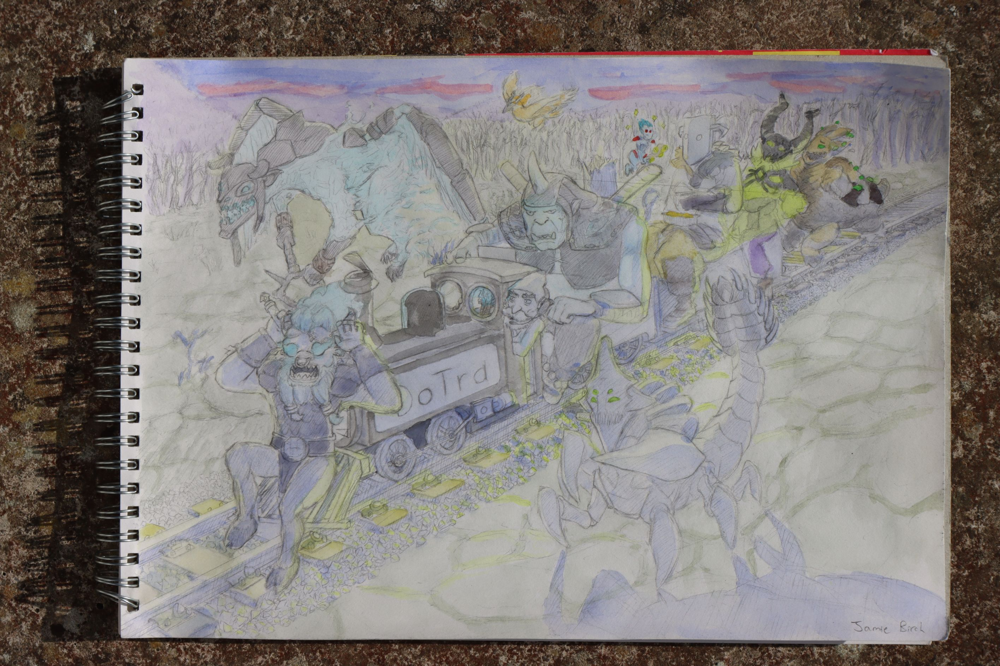
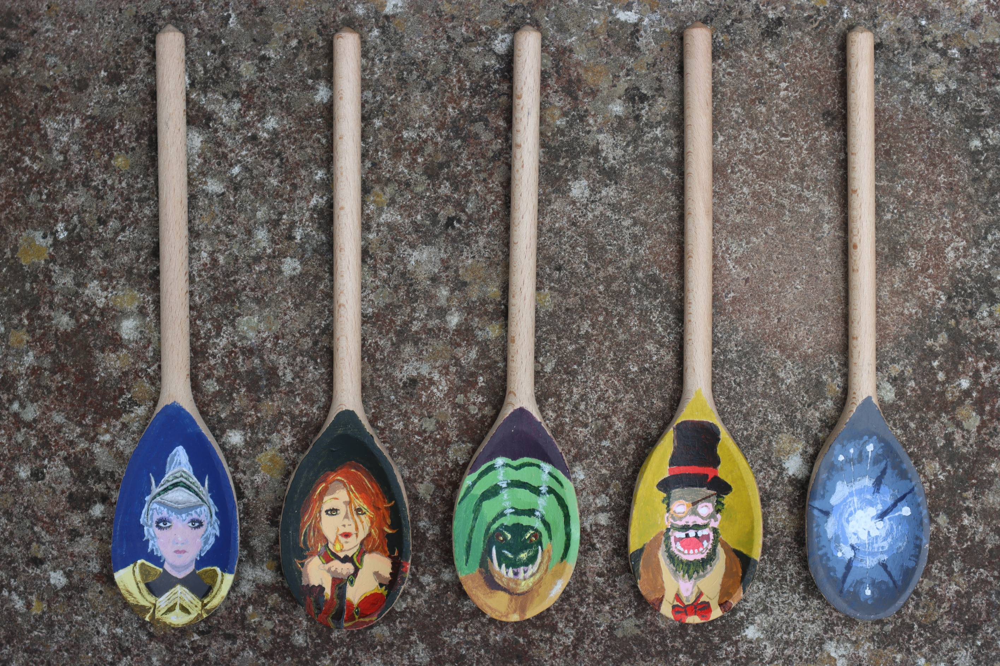
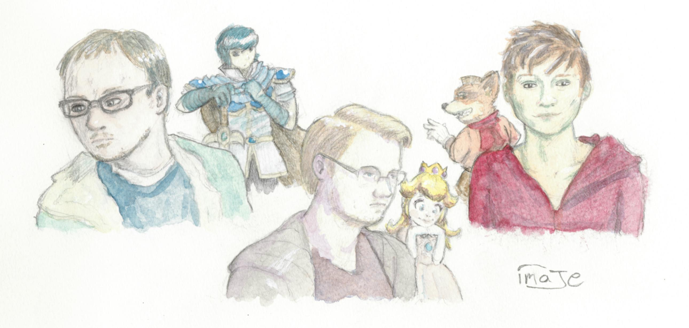

Art used to be my main hobby until 2014 (see my [DeviantArt](https://www.deviantart.com/jamie-b/gallery)), when chronic back pain put a stop to it. But I still draw occasionally!

import { ImageZoom } from "fumadocs-ui/components/image-zoom";

# Whatever, Jamie (27th Jul 2025)

Nowadays, I'm mostly drawing cartoons to accompany articles, rather than pieces with much artistic merit.

Since Feb 11th 2023, I've been adding articles to my newsletter [Whatever, Jamie](https://buttondown.com/whatever_jamie/archive/), and this is the eponymous Jamie. I drew this particular one for my article on 27th Jul 2025, [The many, many, many JavaScript runtimes of the last decade](https://buttondown.com/whatever_jamie/archive/the-many-many-many-javascript-runtimes-of-the-last-decade/).

import WhateverJamie from "./art-img/whatever_jamie_paper_944_75.jpg";

<ImageZoom
  alt="Whatever, Jamie"
  src={WhateverJamie.src}
  width="2832"
  height="2446"
/>

# DotA Train (31st Oct 2022)

This is a piece I painted during the pandemic, as DotA was basically my only social outlet during lockdown. I played DotA each night with my buddies in a group we called the DotA Train.

{/*  */}

import DoTra from "./art-img/dotra_944_80@3x.jpg";

<ImageZoom alt="DotA Train" src={DoTra.src} width="2832" height="1888" />

# DotA spoons (27th May 2022)

I painted these during the pandemic to commemorate our DotA team's victory in an invitational eSports match on 30th Nov 2021, which was [livestreamed](https://www.youtube.com/watch?v=W_6TWXkjmUc) as part of a University of York coursework of some kind.

It was a best of three, in which I played Io (game 1) and Visage (games 2 and 3) as one of the less experienced team members.

It took half a year to finish this, though much of that was due to my motivation being killed by chronic tooth pain.

{/*  */}

import Spoons from "./art-img/spoons_944_70@3x.jpg";

<ImageZoom alt="Spoons" src={Spoons.src} width="2832" height="1888" />

# Smashers (12th Sep 2015)

Super Smash Bros basically made me who I am, so (for better or worse) I owe a lot to it. In this piece, I painted three interesting competitors at the highest level: Mew2King, Armada, and Leffen. I was very proud, when I uploaded this to Facebook, that it detected faces in the image.

{/*  */}

import Smashers from "./art-img/smashers_860_75@3x.jpg";

<ImageZoom alt="Smashers" src={Smashers.src} width="2580" height="1229" />

# Ganbatte, Tombo (6th May 2014)

I watched a lot of Kiki's Delivery Service back in university. I got a lot more watercolours done during the summer, as in the UK that gives you quite a lot of daylight hours to work with.

# Nuzlocke run

From Jun 23rd 2012 to Jun 14th 2014, I did a Pokémon "Nuzlocke run" (where you can only catch one Pokémon per route, and if they faint, they can't be used again), drawing a comic to dramatise it, as was the fashion at the time.

I called my comic a "self improvement run", as the main aim was to get better at art and Japanese (I was playing in Japanese). In the course of this comic, I drew in pencil, digital, felt-tip pen, and for the first time, watercolour. I practiced perspective, expressions, motion, and lighting.

I certainly think I improved a lot, comparing my art before and after it! Can't speak much for any Japanese improvement (Pokémon speech and vocabulary is not very useful), but I did learn a word or two.

## Page 36 (Dec 9th 2013)

At some point, I got into the habit of tracking how long these drawings would take. The commentary on this page says that, in between exams and labs, I only had time to draw 2-3 panels per day, so this one took 2-3 weeks.

I've always found it very hard to keep up motivation when an art piece lasts longer than a day (which, for me, almost all of them do), and so increasingly I'd get interested in trying to find an art style and method that would enable me to draw faster. Nowadays at art meetups, I've settled on Sharpies.

import Nuzlocke36 from "./art-img/nuzlocke_36.jpg";

<ImageZoom alt="Nuzlocke36" src={Nuzlocke36.src} width="1217" height="1739" />

## Page 35 (Nov 26th 2013)

import Nuzlocke35 from "./art-img/nuzlocke_35.jpg";

<ImageZoom alt="Nuzlocke35" src={Nuzlocke35.src} width="1042" height="1688" />

# Bernkastel's despair (12th Dec 2013)

I was into the time-looping murder mystery, Higurashi no Naku Koro Ni, and loved how the main character from it reappears in Umineko no Naku Koro Ni as the Witch of Miracles. I wanted to depict Bernkastel's despair of being forced to loop through time hopelessly for centuries.

{/*  */}

import Bern from "./art-img/bern_cropped_75.jpg";

# Ken and Nina's excellent adventure (16th Jun 2013)

I'm still very proud of this one. Right towards the end of my Nuzlocke run, there was a competition in the Nuzlocke comics community to make a crossover fan comic between two of the most well-known comics by [Ky-Nim](https://www.deviantart.com/ky-nim/gallery/29564554/nuzlocke-white-comic-complete) and [YinDragon](https://www.deviantart.com/yindragon/gallery/33730225/firered-kickass-mode). As I'd spent the whole last year experimenting with different art styles, I wanted to try my hand at mimicking the styles of each of the authors convincingly. The full comic is 700 × 14,255 px tall, so I ended up drawing a lot of panels and having to go all out until the deadline.

I only got a small number of views in the end and no comment from the authors, but was really pleased with this comment:

> This is amazing! I felt like this was an "official" comic made by either comic artists! You really captured the personalities well!!!

# La joie de voler (17th Nov 2012)

Again, I watched a lot of Kiki's Delivery Service back in university. This was one of my first watercolour pieces. I was particularly interested in colour theory back then, and wanted to try doing shadows that weren't grey for once.

# Prancing Suika (16th Oct, 2009)

I was into Touhou Project from secondary school. It got me into Japanese music, and pushed me into learning the language each summer holiday.

