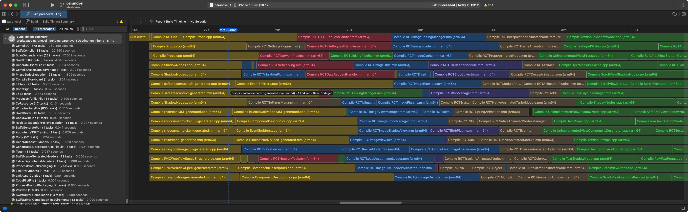
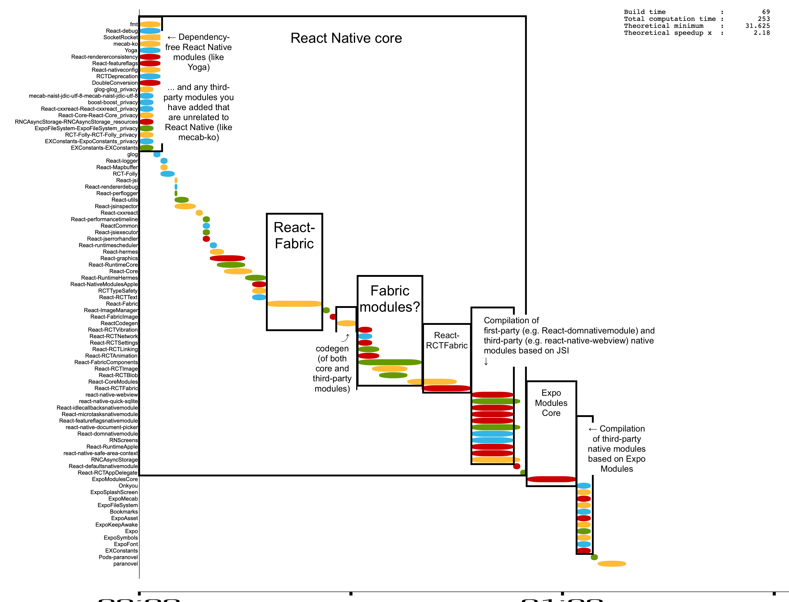
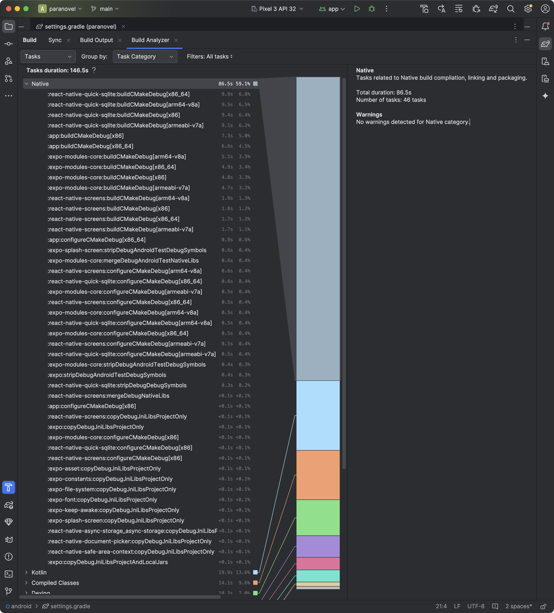
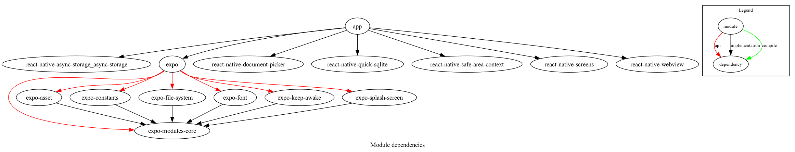
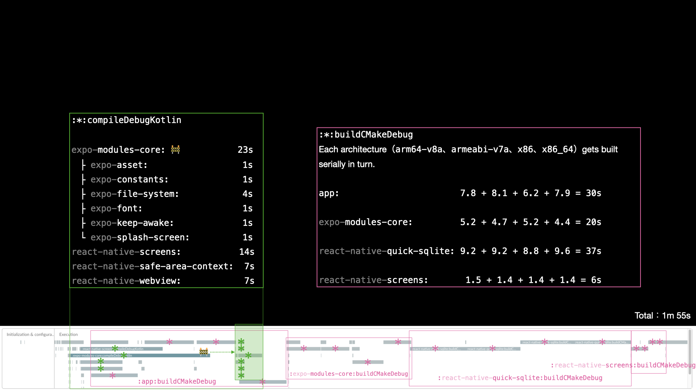

# Apple platforms

## Linear profile

Xcode has built-in profiling tools described thoroughly in Antoine Van der Lee's [blog post](https://www.avanderlee.com/optimization/analysing-build-performance-xcode/). They give a linear profile like this:



While these tools are fine for measuring the length of individual tasks, they're no good for visualising the build cascade (i.e. which build tasks are blocked on which other build tasks). To visualise that, I turn to community-made tools.

## Cascade profile

With [xcode-build-times](https://github.com/PaulTaykalo/xcode-build-times-rendering), which Maksym Shcheglov walks us through [how to use](https://www.onswiftwings.com/posts/build-time-optimization-part1/), we can make lovely build cascades like this:



_(The above result is after a bit of CSS tweaking and manual annotation, as initially it looks cramped like [this](https://x.com/birch_js/status/1884505338801717746))_

# Android

## Gradle Build Analyzer

You can view the task time by category (e.g. external build system, Kotlin compilation, Java compilation, dexing) using [Gradle Build Analyzer](https://developer.android.com/build/build-analyzer):



## Module graph

Using [gradle-dependency-graph-generator-plugin](https://github.com/vanniktech/gradle-dependency-graph-generator-plugin) (or the newer [module-graph](https://github.com/iurysza/module-graph), which I haven't tried out), you can visualise the dependency graph of all your project modules, which can inform build blockers (e.g. here, you can see that all the `expo-*` modules depend upon `expo-modules-core`).



It makes for a nice Powerpoint slide, but if you want to understand build times as well, you'll need a cascade profile.

## Cascade profile

The best tool I've found is [Gradle Profiler](https://github.com/gradle/gradle-profiler). It has many features, but I particularly liked [Build Scan](https://gradle.com/develocity/product/build-scan/), which helps visualise the build waterfall. You can use it to create timelines like this (original archived [here](https://web.archive.org/web/20250916212448/https://scans.gradle.com/s/fzrvu4jy4phac/timeline)):



(_Again, I've put some manual annotations on top, of course. All Gradle Profiler gives you is the timeline._)

Full instructions for installation and running can be found on Gradle Profiler's [README](https://github.com/gradle/gradle-profiler?tab=readme-ov-file#gradle-build-scans), but in brief:

```sh
# Install it system-wide.
brew install gradle-profiler

# After creating a `scenarios.txt` (see below), run this to create a Build Scan:
gradle-profiler --profile buildscan --project-dir ./android --scenario-file scenarios.txt simple_build
```

<Callout type='warn'>

The Build Scan is **hosted publicly**, so be careful if you're working on private code, as things like your library and build task names will be visible for all to see. Fortunately, there's a button in the sidebar to delete the Build Scan if needed.

I imagine it's possible to get private hosting through the exchange of money, though.

</Callout>

You'll need a [scenario file](https://github.com/gradle/gradle-profiler?tab=readme-ov-file#advanced-profiling-scenarios). A `scenarios.txt` can be as simple as:

```
simple_build {
  tasks = [":app:assembleDebug"]
  cleanup-tasks = ["clean"]
  daemon = cold
}
```
