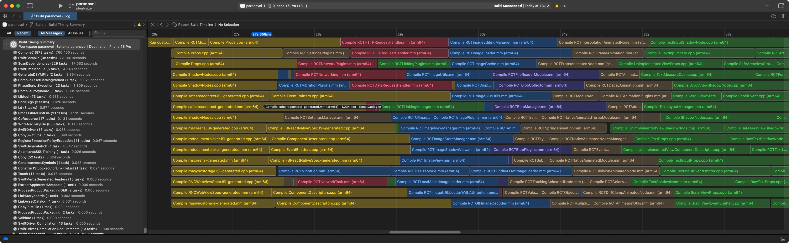

# Xcode

## Built-in profiling

Xcode has built-in profiling tools described thoroughly in this [blog post](https://www.avanderlee.com/optimization/analysing-build-performance-xcode/). They give a profile like this:

While these tools are fine for measuring the length of individual tasks, they're a bit hard to use for visualising blockers in the build. If I want that, I turn to community-made tools.

## Community-made profiling

xcode-build-times:
https://x.com/birch_js/status/1884505338801717746

# Gradle

- https://www.onswiftwings.com/posts/build-time-optimization-part1/

Gradle Profiler build profile config:
https://x.com/birch_js/status/1899975428175257884
